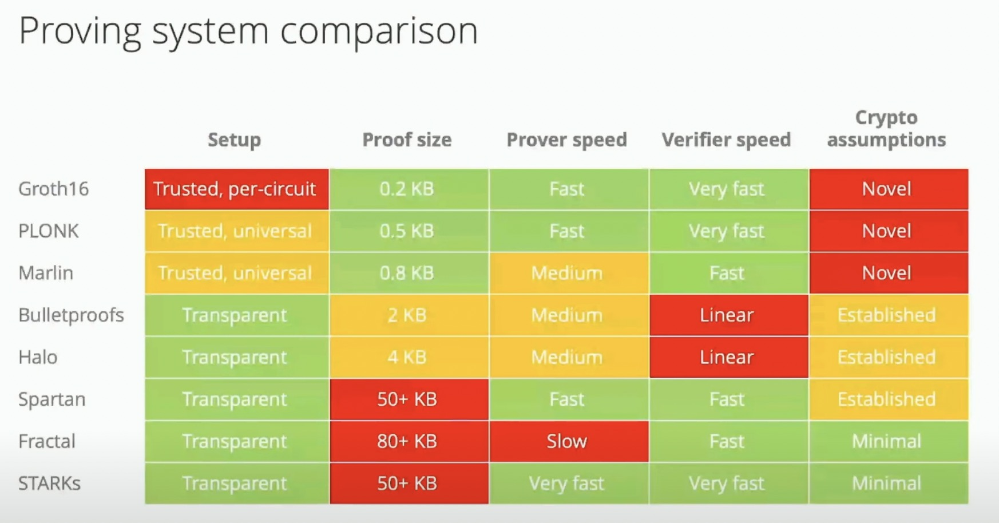
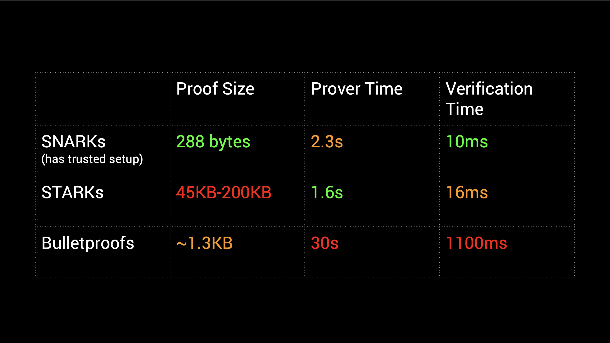
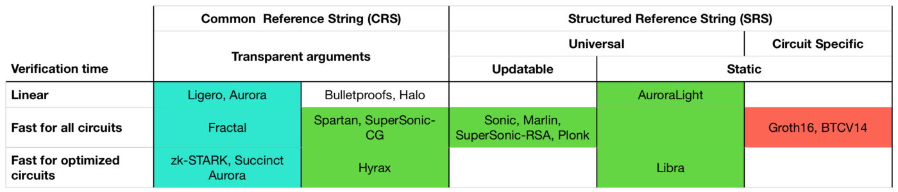
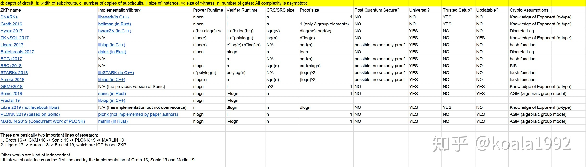

  <h1 align="center">Awesome ZKPs</h1>
  

    
    
  

  
  
A curated list of awesome ZKP resources, libraries, tools and more.

  
Please check the <a href="CONTRIBUTING.md">contribution guidelines</a> for information on formatting and writing pull requests.

  

### Contents

- [Introductions](#introductions)
- [Tutorials](#tutorials)
- [Programming Languages](#programming-languages)
- [Tools](#tools)
  - [ZoKrates: a toolbox for zkSNARKs](#zokrates-a-toolbox-for-zksnarks)
  - [Snarkjs: zkSNARK implementation in JavaScript & WASM](#snarkjs-zksnark-implementation-in-javascript--wasm)
- [Books](#books)
- [Communities](#communities)
- [Other Curated Lists](#other-curated-lists)
- [Proof Systems](#proof-systems)
  - [zkSNARKs](#zksnarks)
    - [PLONK](#plonk)
      - [Videos](#videos)
  - [zkSTARKs](#zkstarks)
  - [Bulletproofs](#bulletproofs)
- [Trusted Setup](#trusted-setup)
  - [Subversion Resistance](#subversion-resistance)
- [Applications](#applications)
  - [Blockchains](#blockchains)
  - [Games](#games)
  - [Machine learning and AI](#machine-learning-and-ai)
  - [Auctions](#auctions)
  - [Marketplace](#marketplace)
  - [Social](#social)
  - [Mixer](#mixer)
  - [Rollup](#rollup)
  - [Tokens / NFT](#tokens--nft)
  - [Voting / Participation](#voting--participation)
  - [Identity](#identity)
  - [Attestation](#attestation)
  - [Other app directories](#other-app-directories)
- [License](#license)

## Introductions
- [Understanding ZKPs Through Illustrated Examples](https://blog.goodaudience.com/understanding-zero-knowledge-proofs-through-simple-examples-df673f796d99)
- [Zero Knowledge Proofs: An Illustrated Primer by Matthew Green](https://blog.cryptographyengineering.com/2014/11/27/zero-knowledge-proofs-illustrated-primer/)
- [Demonstration of Zero-Knowledge Proof for Sudoku Using Standard Playing Cards](https://www.wisdom.weizmann.ac.il/~naor/PAPERS/SUDOKU_DEMO/)
- [zudoku](https://zudoku.xyz/): ZK proving knowledge of Sudoku solutions
- [Zero Knowledge Proof and its Applications in Bitcoin](https://xiaohuiliu.medium.com/zero-knowledge-proof-and-its-applications-in-bitcoin-aca833d7d745)
- [zk-SNARKs on Bitcoin](https://xiaohuiliu.medium.com/zk-snarks-on-bitcoin-239d96d182bd)
- [ZKPs for Engineers: Introduction](https://blog.zkga.me/intro-to-zksnarks)

## Tutorials
- [zk Battleship interactive course by sCrypt](https://academy.scrypt.io)
- [Create Your First Zero-Knowledge Proof Program on Bitcoin](https://xiaohuiliu.medium.com/create-your-first-zero-knowledge-proof-program-on-bitcoin-ec159cc501f4): use ZoKrates
- [Intro to Circom and Snarkjs by Iden3](https://iden3-docs.readthedocs.io/en/latest/iden3_repos/circom/TUTORIAL.html)
- [Getting Started with zkSnarks on ZoKrates](https://blog.gnosis.pm/getting-started-with-zksnarks-zokrates-61e4f8e66bcc)
- [Proving Knowledge of a Hash Pre-Image with ZoKrates](https://blog.decentriq.com/proving-hash-pre-image-zksnarks-zokrates/)
- [Zokrates Hello World Walkthrough](https://hackmd.io/@adietrichs/HkH0OduZw)
- [Zero Knowledge Proofs Workshop - Zokrates Tutorial](http://extropy.foundation/workshops/zkp/zokrates.html)
- [A Practical Guide To Building Zero Knowledge dApps](https://kndrck.co/posts/practical_guide_build_zk_dapps/): Circom
- [0xPARC circom and Halo2 learning resources](https://learn.0xparc.org)

## Programming Languages 
- [Introduction to Domain Specific Languages (DSLs)](https://youtu.be/kqnYbSmdcbA?t=392) by Alex Ozdemir
- [Programming Languages in ZKP](https://medium.com/delendum/thoughts-of-programming-languages-in-zkp-c906e96f056e) by Delendum Ventures: video is on [YouTube](https://www.youtube.com/channel/UCM7Dc3y3BVTTpprDidVV7iw)

| Name  | Type | GitHub | Documentation | 
| ------------- |:-------------:|:-------------:|:-------------:|
| ZoKrates     | Python subset   | https://github.com/Zokrates/ZoKrates | https://zokrates.github.io |
| Circom |  HDL   | https://github.com/iden3/circom | https://docs.circom.io |
| SnarkyJS | Typescript DSL | https://github.com/o1-labs/snarkyjs | https://docs.minaprotocol.com/en/zkapps/snarkyjs-reference | 
| Cairo     | for STARK  | https://github.com/starkware-libs/cairo-lang | https://book.cairo-lang.org/ | 
| Leo      | Functional, statically-typed  | https://github.com/AleoHQ/leo | https://developer.aleo.org/developer/language/layout/ |

## Tools
### ZoKrates: a toolbox for zkSNARKs
Both on [Bitcoin](https://github.com/sCrypt-Inc/zokrates) and [Ethereum](https://zokrates.github.io/)
- [Zero Knowledge Proofs Workshop - Zokrates Tutorial](http://extropy.foundation/workshops/zkp/zokrates.html)
- [Zokrates Hello World Walkthrough](https://hackmd.io/@adietrichs/HkH0OduZw)
- [Practical ZK-SNARKs for Ethereum](https://coders-errand.com/practical-zk-snarks-for-ethereum/)
- [Elliptic Curve BLS12–381 Support on Bitcoin](https://xiaohuiliu.medium.com/guest-post-elliptic-curve-bls12-381-support-on-bitcoin-bc7bfa605135)

### Snarkjs: zkSNARK implementation in JavaScript & WASM
Both on [Bitcoin](https://github.com/sCrypt-Inc/snarkjs) and [Ethereum](https://github.com/iden3/snarkjs)
- [Circom Workshop 1 by 0xparc](https://learn.0xparc.org/materials/circom/learning-group-1/circom-1)
- [Circom Workshop 2 by 0xparc](https://learn.0xparc.org/materials/circom/learning-group-1/circom-2)

## Books

- [Proofs, Arguments, and Zero-Knowledge](https://people.cs.georgetown.edu/jthaler/ProofsArgsAndZK.pdf) (Justin Thaler, 2022)
- [A Graduate Course in Applied Cryptography](http://toc.cryptobook.us/book.pdf) (Dan Boneh and Victor Shoup, 2020)
- [The MoonMath Manual to zk-SNARKs](https://leastauthority.com/community-matters/moonmath-manual): minimal experience in cryptography required

## Communities
- [Zero-knowledge podcast](https://www.zeroknowledge.fm): #1 podcast for ZK
- [0xPARC: Applied ZK Learning Group](https://learn.0xparc.org/)
- [ZKProof](https://zkproof.org/): an academic and industry initiative for standardizing ZKPs

## Other Curated Lists
- [matter-labs: Awesome zero knowledge proofs](https://github.com/matter-labs/awesome-zero-knowledge-proofs)
- [ventali/awesome-zk](https://github.com/ventali/awesome-zk)
- [zkp.science](https://zkp.science)
- [Zero-Knowledge Proofs Starter Pack](https://ethresear.ch/t/zero-knowledge-proofs-starter-pack/4519)
- [gakonst/awesome-starknet](https://github.com/gakonst/awesome-starknet)
- [Zero Knowledge Canon by a16z](https://a16zcrypto.com/zero-knowledge-canon/)
- [ZKP Knowledge Base by Delendum Research](https://kb.delendum.xyz/)

## Proof Systems
- [Comparison of the most popular zkp systems](https://github.com/matter-labs/awesome-zero-knowledge-proofs#comparison-of-the-most-popular-zkp-systems)

|                                       | SNARKs                     | STARKs                        | Bulletproofs    |
| ------------------------------------: | -------------------------: | ----------------------------: | --------------: |
| proving time       | O(N * log(N))              | O(N * poly-log(N))            | O(N * log(N))   |
| verifying time      | ~O(1)                      | O(poly-log(N))                | O(N)            |
| proof size | ~O(1)                      | O(poly-log(N))                | O(log(N))       |
| Trusted setup required?               | SOMETIMES :neutral_face:             | NO :smile:                    | NO :smile:      |

- [🏋️‍♀️ ZK Bench](https://zkbench.dev) - open source, continuous benchmarks for popular zk implementations

| | [**Polylang**](https://polylang.dev) | [**Miden**](https://docs.polygon.technology) | [**Risc Zero**](https://risczero.com/) | [**Noir (Barretenberg)**](https://noir-lang.org/) | [**Leo**](https://leo-lang.org/) |
|---|---|---|---|---|---|
| **Frontend (Language)** | Typescript-like | MASM (Assembly) | Rust, C, C++ | Rust-like | Leo (DSL) |
| **ZK** | STARK | STARK / zkVM | STARK / zkVM | SNARK | SNARK |
| **Unbounded Programs** | ✅ | ✅ | ✅ | ❌ | ❌ |
| **Audit** | ❌ Planned 2024 | ❌ Planned 2024 | ❌ Planned 2024 | ❌ Planned 2024 | ❌ Planned 2023 |
| **External Libraries** | ❌ | ⚠️ | ✅ | ⚠️ | ⚠️ |
| **EVM Verifier** | ⚠️ | ⚠️ | ✅ | ✅ | ❌ |
| **GPU** | ✅ Metal | ✅ Metal | ✅ Metal, CUDA | ❌ | ❌ |
| **Assert** | 0.05s | 0.03s | 6.18s | 0.01s | 3.11s |
| **Optimised Hashes** | RPO+2 more | RPO+2 more | SHA-256 | Pedersen+2 more | Pedersen+3 more |
| **SHA-256 Hash** |  |  |  |  |  |
| **1k bytes** | 21.55s | 20.33s | 6.20s | 3.63s | 2.81s |
| **10k bytes** | 235.71s | 177.79s | 6.27s | 33.89s | 10.81s |
| **Pedersen Hash** |  |  |  |  |  |
| **1k bytes** | ❌ | ❌ | ❌ | 0.54s | 1.99s |
| **10k bytes** | ❌ | ❌ | ❌ | 1.87s | 2.28s |
| **RPO Hash** |  |  |  |  |  |
| **1k bytes** | 0.17s | 0.03s | ❌ | ❌ | ❌ |
| **10k bytes** | 1.85s | 0.30s | ❌ | ❌ | ❌ |
| **Fibonacci** |  |  |  |  |  |
| **1** | 0.03s | 0.03s | 6.20s | 0.01s | 1.89s |
| **10** | 0.05s | 0.03s | 6.21s | 0.01s | 1.89s |
| **100** | 0.16s | 0.03s | 6.20s | 0.01s | 1.88s |
| **1,000** | 2.56s | 0.08s | 6.17s | 0.01s | 1.89s |
| **10,000** | 21.17s | 0.59s | 12.57s | 0.01s | 1.91s |
| **100,000** | 221.24s | 9.55s | 105.13s | 0.01s | 🚧 |
| **Merkle Tree** |  |  |  |  |  |
| **Membership Proof** | 🚧 | 0.06s | 12.56s | 3.52s | 🚧 |
| **Merge** |  |  |  |  |  |
| **1 + 1** | 🚧 | 0.06s | 12.65s | 🚧 | 🚧 |

- [Proving system comparison](https://youtu.be/LBTrX0Ukdvs?t=309) 
- [zk-SNARKs vs. Zk-STARKs vs. BulletProofs](https://ethereum.stackexchange.com/questions/59145/zk-snarks-vs-zk-starks-vs-bulletproofs-updated) 
- [Comparing General Purpose zk-SNARKs](https://medium.com/coinmonks/comparing-general-purpose-zk-snarks-51ce124c60bd) 
- [Comparison of Different zk-SNARKs](https://zhuanlan.zhihu.com/p/40245832) 
- [A Cambrian Explosion of Crypto Proofs Eli Ben-Sasson](https://nakamoto.com/cambrian-explosion-of-crypto-proofs/)

### zkSNARKs

#### PLONK
- [Awesome PLONK](https://github.com/fluidex/awesome-plonk): a curated list of awesome things related to Plonk
- How PLONK works by sCrypt: [Part 1](https://xiaohuiliu.medium.com/how-plonk-works-part-1-bc8050f4805e) and [Part 2](https://xiaohuiliu.medium.com/how-plonk-works-part-2-1072dcd7634a)
- [PLONK on Bitcoin](https://xiaohuiliu.medium.com/plonk-on-bitcoin-bb5405820e82)
- [PLONK by Hand](https://research.metastate.dev/plonk-by-hand-part-1/): 3 parts from MetaState
- [A good tutorial on PLONK in CN](https://blog.csdn.net/AdijeShen/article/details/123332665)
- [Understanding PLONK by Vitalik](https://www.vitalik.ca/general/2019/09/22/plonk.html)
- [Understanding PLONK by David Wong](https://www.cryptologie.net/article/527/understanding-plonk/)
- [A Python tutorial of the paper PLONK](https://github.com/barryWhiteHat/plonk_tutorial)
- [Another good tutorial on PLONK in CN](https://www.jianshu.com/p/889b7e09ae9a)

##### Videos
- [ZK Study Club - Plonk with Zac Williamson](https://youtu.be/NqrVcDuQ8hM)
- [How PLONK works by David Wong](https://www.youtube.com/playlist?list=PLBJMt6zV1c7Gh9Utg-Vng2V6EYVidTFCC): a 12-part series
- [PLONK: Privacy in a World of Universal SNARKs - Zac Williamson](https://youtu.be/V7Hmtan98r8)
- [PLONK: Ariel Gabizon (Protocol Labs)](https://youtu.be/dHo56MhQlHk)

### zkSTARKs

### Bulletproofs

## Trusted Setup
- [The Incredible Machine](https://medium.com/qed-it/the-incredible-machine-4d1270d7363a): ZKP proving Sudoku and physical trusted setup
- [Diving into the zk-SNARKs Setup Phase](https://medium.com/qed-it/diving-into-the-snarks-setup-phase-b7660242a0d7)
- [Trusted Setup Workshop by 0xparc](https://learn.0xparc.org/materials/learning-group-1/trusted-setup)
- [Setup Ceremonies](https://zkproof.org/2021/06/30/setup-ceremonies/)
- [On-Chain Trusted Setup Ceremony](https://a16zcrypto.com/on-chain-trusted-setup-ceremony/)
- [How do trusted setups work?](https://vitalik.ca/general/2022/03/14/trustedsetup.html)
- [Announcing the Perpetual Powers of Tau Ceremony to benefit all zk-SNARK projects](https://medium.com/coinmonks/announcing-the-perpetual-powers-of-tau-ceremony-to-benefit-all-zk-snark-projects-c3da86af8377)
- [Trusted setup ceremonies explored](https://www.zeroknowledge.fm/133)

### Subversion Resistance
- [A Subversion-Resistant SNARK](https://eprint.iacr.org/2017/599)
- [Zero knowledge, subversion resistance, and concrete attacks | Steven Goldfeder | RWC 2018](https://youtu.be/DP8xSEM9bd8)
- [Zero-Knowledge Contingent Payments Revisited](https://eprint.iacr.org/2017/566)

## Applications
### Blockchains
- [Zcash: Privacy-Protecting Digital Currency](https://z.cash) (SNARKs)
- [Monero: Private Digital Currency](https://www.getmonero.org) (Bulletproofs)
- [Mina Protocol: A Constant-Size Blockchain](https://minaprotocol.com/) (recursive SNARKs)
- [Namada: Asset Agnostic, Multichain privacy](https://namada.net/) (SNARKs)

### Games
- [Incomplete Information Games on Bitcoin](https://xiaohuiliu.medium.com/incomplete-information-games-on-bitcoin-d79408050882)
- [Dark Forest: zkSNARK space warfare strategy game](https://zkga.me/)
- [Battleship](https://xiaohuiliu.medium.com/introducing-zkbattleship-the-worlds-first-interactive-zero-knowledge-proof-tutorial-95d1fc5f65cb): the World’s First Interactive Zero-Knowledge Proof Tutorial
- [Zordle: ZK Wordle](https://github.com/nalinbhardwaj/zordle): the first e2e web app built using Halo 2 ZK proofs
- [Mastermind](https://weijiek.medium.com/how-i-learned-zk-snarks-from-scratch-177a01c5514e) and its [repo](https://github.com/weijiekoh/zkmm)
- [exgrasia](https://github.com/nalinbhardwaj/exgrasia): On-chain RPG-style sandbox game
- [Sudoku](https://github.com/nalinbhardwaj/snarky-sudoku)
- [zksnark-sudoku](https://github.com/web3-master/zksnark-sudoku)
- [Isaac: a physics-powered onchain reality on Starknet](https://topology.gg/) and their [blog](https://www.guiltygyoza.xyz/2022/05/topology-isaac-defcon)
- [Crypto Maze: action-packed MMO](https://www.cryptomaze.app/)
- [Mental Poker](https://blog.cryptographyengineering.com/2012/04/02/poker-is-hard-especially-for/)  
  - Mental Poker in the Age of SNARKs: [part 1](https://geometry.xyz/notebook/mental-poker-in-the-age-of-snarks-part-1 ) and [part 2](https://geometry.xyz/notebook/mental-poker-in-the-age-of-snarks-part-2)
  - [ZK Poker](https://medium.com/coinmonks/zk-poker-a-simple-zk-snark-circuit-8ec8d0c5ee52)
  - [sample code in Circom](https://github.com/glamperd/snark-example/tree/master/poker)
- [Cachebox](https://github.com/qcomps/cachebox): an escape game built on the MINA blockchain
- [Lottery](https://killari.medium.com/zero-knowledge-lottery-437e456dc3f2)
- [chess-cairo - A Cairo contract to play chess in Starknet](https://github.com/greenlucid/chess-cairo)
- [GoL2 - Cellular automata on replicated state machine](https://github.com/perama-v/GoL2)
- [zkAutoChess: An On-chain Auto Chess Battle Game](https://talk.harmony.one/t/zkautochess-an-on-chain-auto-chess-battle-game/18375)

### Machine learning and AI
- [MNIST for recognizing handwritten digits on Bitcoin](https://xiaohuiliu.medium.com/zero-knowledge-private-machine-learning-on-bitcoin-a5bacc6508b1)
- [zk-MNIST: web frontend app + Jupyter notebook with ML model generation on Ethereum](https://github.com/0xZKML/zk-mnist) and their [demo](https://zkmnist.netlify.app/)
- [zkCNN: GKR-based zero-knowledge proof protocol for CNN model inference](https://github.com/TAMUCrypto/zkCNN) and their [paper](https://eprint.iacr.org/2021/673.pdf)

### Auctions
- [Blind auction using zero knowledge](https://github.com/heivenn/zk-blind-auction): [discussion](https://talk.harmony.one/t/zero-knowledge-blind-auctions/18600)
- [Publicly Verifiable Sealed-Bid Auctions with a Trustless Auctioneer](https://medium.com/@vaheandonians/publicly-verifiable-sealed-bid-auctions-with-a-trustless-auctioneer-4aa50197f00c)

### Marketplace
- [A collection of solutions leveraging the power of ZK information bounties](https://github.com/sCrypt-Inc/zk-bounties)
- [Nightmarket: a Dark Forest plugin that allows players to buy and sell planet coordinates](https://blog.zkga.me/nightmarket): [a blog post](https://blog.zkga.me/nightmarket)
- [Modulo Zero: on-chain solution for private data exchange](https://modulozero.xyz/) and their [Repo](https://github.com/nulven/EthDataMarketplace)
- [zkPoD: A Practical Decentralized System for Data Exchange](https://github.com/sec-bit/zkPoD-node)

### Social
- [Zkitter: Anonymous Social Network](https://hackmd.io/@catsnackattack/Bkov8Jz-s#zkitterzkchat)
- [ETHdos Numbers](https://ethdos.xyz): measure your degrees of separation from Vitalik using recursive SNARKs

### Mixer
- [Tornado Cash: Introducing Private Transactions On Ethereum](https://tornado-cash.medium.com/introducing-private-transactions-on-ethereum-now-69fb059a14a1)
- [Otter Cash: A privacy layer for the Solana ecosystem](https://otter.cash/)

### Rollup
- [ZK-Rollups on Bitcoin](https://medium.com/coinmonks/zk-rollups-on-bitcoin-ce35869b940d): Way More Scalable than on Ethereum

### Tokens / NFT
- [Scalable Peer to Peer Tokens on Bitcoin](https://xiaohuiliu.medium.com/scalable-peer-to-peer-tokens-on-bitcoin-3fb2b2c4da25): Solve the Back-to-Genesis Problem using recursive SNARKs
- [StealthDrop: Anonymous Airdrops using ZK proofs](https://github.com/nalinbhardwaj/stealthdrop)
- [ZKP Private Airdrop](https://github.com/a16z/zkp-merkle-airdrop-contracts) and their [Zk Merkle Airdrop Library](https://github.com/a16z/zkp-merkle-airdrop-lib)
- [zk-NftMint: Mint an NFT if you know a secret](https://github.com/weijiekoh/zknftmint) and their [contract](https://goerli.etherscan.io/address/0xc4490d6407f81378c8d3620eA11092B2FC429Df2)

### Voting / Participation
- [Zero Knowledge Message Board by nulven, yush\_g](https://github.com/nulven/zk-message-board) and their [article](https://mirror.xyz/0x3FD6f213ae1B8a7B6bd8f14BE9BF316a5e5A5d28/VTGpmEYLKIslUPf66VQzHUneB0R7EhMpJJ_mGrMvTwY)
- [Semaphore: a privacy gadget built on Ethereum](https://medium.com/coinmonks/to-mixers-and-beyond-presenting-semaphore-a-privacy-gadget-built-on-ethereum-4c8b00857c9b)
- [ZKU-Vote: a platform that allows anonymous voting](https://talk.harmony.one/t/zku-vote-anonymous-voting-within-dao/18423)
- [OVOTE: Offchain Voting with Onchain Trustless Execution](https://forum.aragon.org/t/we-present-ovote-offchain-voting-with-onchain-trustless-execution/3603) and their [document](https://forum.aragon.org/t/we-present-ovote-offchain-voting-with-onchain-trustless-execution/3603)

### Identity
- ZK Identity: Why and How by 0xPARC [Part 1](https://0xparc.org/blog/zk-id-1) and [Part 2](https://0xparc.org/blog/zk-id-2)
- [ZK-Identity (Semaphore): Private Identity Claim System by minting a NFT](https://talk.harmony.one/t/zk-identity-semaphore-private-identity-claim-system-by-minting-a-nft/18789)
- [Interop: An on-ramp for reputation](https://mirror.xyz/privacy-scaling-explorations.eth/w7zCHj0xoxIfhoJIxI-ZeYIXwvNatP1t4w0TsqSIBe4): a bridge for moving reputation from centralized into decentralized systems
- [Aletheia: an anonymous & on-chain reputation based login system for websites](https://talk.harmony.one/t/aletheia-reputation-based-anonymous-login-system/18469)
- [Continuum: background checker](https://talk.harmony.one/t/continuum-zk-background-checker/19627)
- [Proof of Passport: proof of official passport](https://github.com/zk-passport/proof-of-passport)

### Attestation
- [zkAttestor: Block and State Attestations on Ethereum](https://youtu.be/2-yYtEJdrFY): [repo](https://github.com/yi-sun/zk-attestor)
- [zkPhoto: Private Authentic Photo Sharing](https://talk.harmony.one/t/zkphoto-private-authentic-photo-sharing/14375)
- [Using ZK Proofs to Fight Disinformation](https://medium.com/@boneh/using-zk-proofs-to-fight-disinformation-17e7d57fe52f): proofs of permissible photo edits
- [zkDocs: Document Management](https://a16zcrypto.com/zkdocs-zero-knowledge-information-sharing/): [Github repo](https://github.com/a16z/zkdocs)
- [UniRep (Universal Reputation): a private and non-repudiable reputation system](https://docs.unirep.io/)

### Other app directories
- [Bitcoin SV Zero-Knowledge Proof Hackathon finalists](https://bsvhackathon.devpost.com/project-gallery)
- [zkDAO category from Harmony](https://talk.harmony.one/c/governance/zkdao/84)
- [Cairo goldmine](https://github.com/beautyisourbusiness/cairo-goldmine#gaming): A comprehensive, annotated list repos in STARKNET
- [ventali/awesome-zk](https://github.com/ventali/awesome-zk#zk-applications)
- [Six Moonshot ZK Applications](https://gubsheep.substack.com/p/six-moonshot-zk-applications)
- [Final Projects by ZKU Graduates](https://zku.one/final-project-submissions)
- [10 zkApps Use Cases on Mina Protocol](https://blog.o1labs.org/10-snapps-use-cases-on-mina-83e646010e52)

---

## License

To the extent possible under law, sCrypt Inc has waived all copyright and related or neighboring rights to this work.
